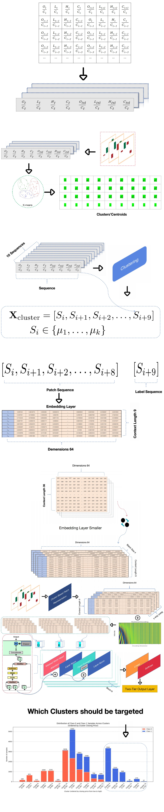

## A Simplified Transformer Clustering Demonstration
  
*This diagram illustrates the process of clustering data to reduce the embedding layer size in transformer models. The visualization shows how high-dimensional embeddings can be effectively grouped to create a more compact representation while preserving essential patterns.*
